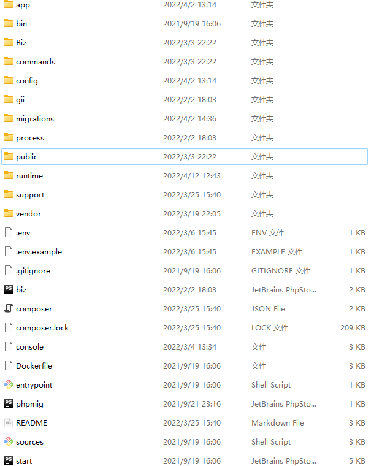
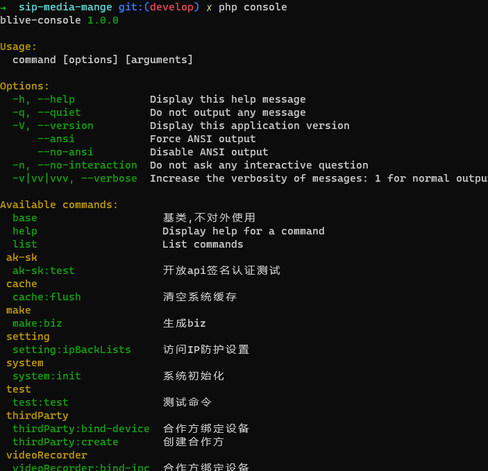
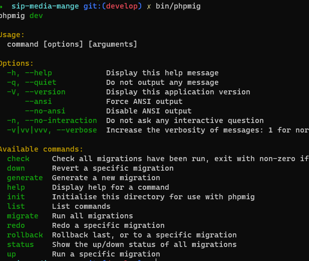
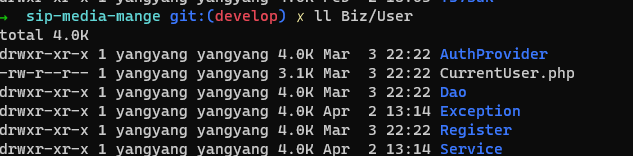
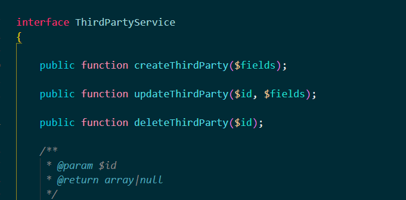
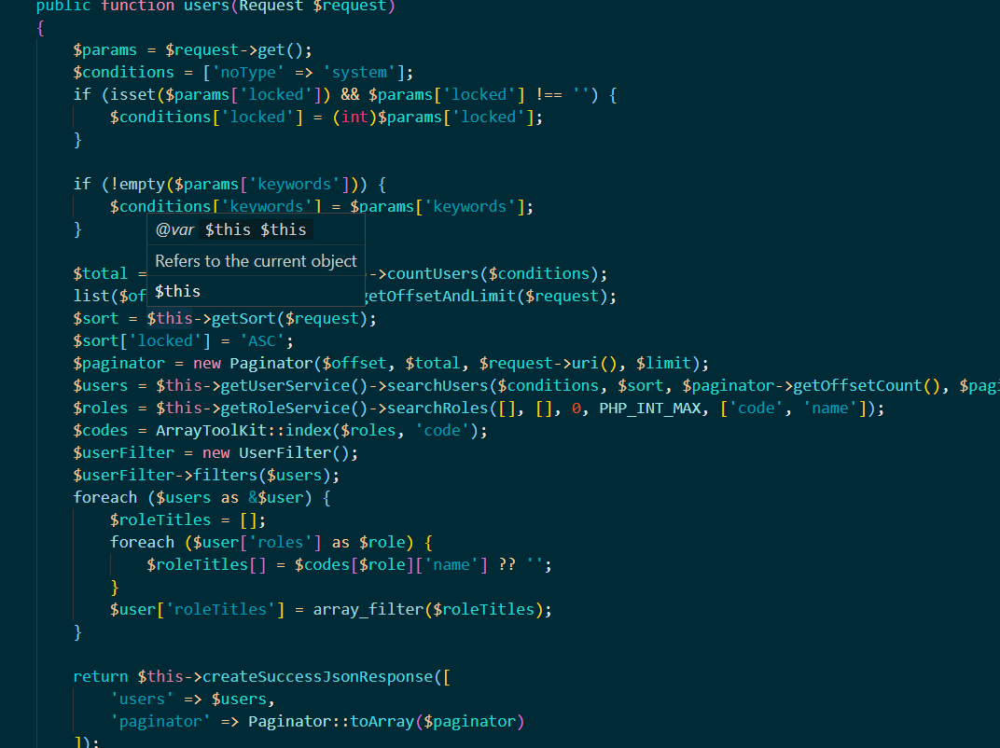
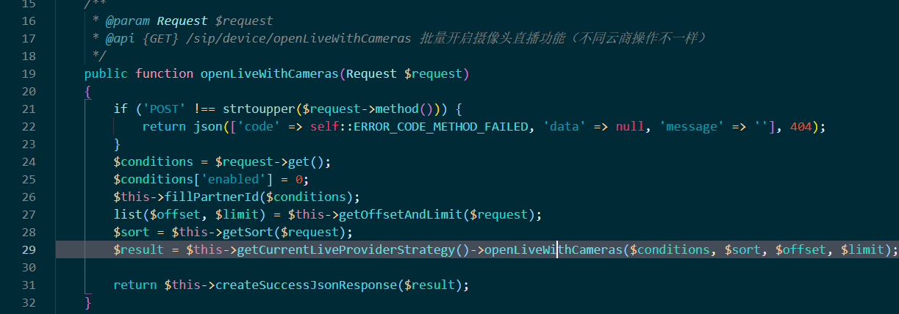

# webman-biz-framework
webman的基础上扩展的一个服务层框架层
## 框架结构

1. service 层使用开源项目 [Biz Framework](https://github.com/codeages/biz-framework)
2. 在webman的资源层增加了service层
3. 在webman的增加biz的依赖注入
4. ...

## 实现功能
1. 满足biz所有的功能模块
- Container
- Config
- Database Connection
- Database Migration
- Cache
- Dao
- Service
- Event
- Validation
- Logger
- Exception
2. 数据库迁移，使用开源项目[phpmig](https://github.com/davedevelopment/phpmig)
3. 终端命令行，使用symfony的console组件
4. 快速生成service层代码（因为service基础功能，因此定制了基础的代码模板用于快速生成）


## 使用
1. migrate使用
```shell
bin/phpmig help
```
2. console使用
```shell
php console list
```
3. 生成service层
``` shell
 // 例如：生成用户user的服务层(业务层名称大驼峰要求）
 php console make:biz User
 // 例如：生成日志log，这时候日志的表名称是 setting_log
 php console make:biz Log setting_log
 // 暂不支持在同一业务层目录下生成相关连的service，比如：用户层user 关联的用户Token UserTokenService 需要放到Biz\User\Service 和 Biz\User\Dao 里，可以手动放入，该功能后期可以完善
```
## DEMO
  执行migrate后，终端运行`php console terms:import true`, 再启动该项目，首页展示的一个检索demo，可输入`1.0`再输入框进行搜索

## 快速开始

1. 新建数据表（以article表为例）
   用工具生成表并复制好生成表的sql语句
   
2. 配置系统参数
   ```shell
   cp .env.example .env
   ```
   env里面主要配置的是数据库
   
3. 生成迁移脚本
   ```shell
      bin/phpmig generate article_table
   ```
   参考已有的migrate的脚本替换当前需要的sql语句
   
4. 生成service层
   ```shell
     php console make:biz Article
     # 如果需要自定义表名的可以：php console make:biz Article article2
     # 代码调用顺序：资源层（command ，controller，reset resource）->服务层（service层)->数据层（Dao层）
   ```
   
5. 创建路由（建议使用路由方式开发）
   在`config/route.php` 写路由，写法参看webman官方
   
6. 资源层代码编写
```php
<?php
# 下面是参考写法，具体可以参看GitHub上的biz官方的tests目录下的代码


namespace App\controller;


use App\AbstractController;
use Biz\Article\Service\ArticleService;
use support\Request;
use support\utils\Paginator;

class Article extends AbstractController
{
    public function search(Request $request)
    {
        $conditions = [];
        $params = $request->get();
        if (!empty($params['keywords'])) {
            $conditions['titleLike'] = $params['keywords'];
        }
        $total = $this->getArticleService()->countArticles($conditions);
        list($offset, $limit) = $this->getOffsetAndLimit($request);
        $sort = $this->getSort($request);
        $sort['createdTime'] = 'DESC';
        $paginator = new Paginator($offset, $total, $request->uri(), $limit);
        $items = $this->getArticleService()->searchArticles($conditions, $sort, $paginator->getOffsetCount(), $paginator->getPerPageCount());

        return $this->createSuccessJsonResponse([
            'articles' => $items,
            'paginator' => Paginator::toArray($paginator)
        ]);
    }

    /**
     * @return ArticleService
     */
    protected function getArticleService()
    {
        return $this->createService('Article:ArticleService');
    }
}
  
```

7. 开启redis
   `.env`文件里面解开redis相关配置的注释
   
8. 主要日志查询
  - Biz框架-biz日志
    这个日志主要记录操作数据库的sql语句，当我们再开发环境（APP_DEBUG值决定环境）便会记录，生产环境不记录日志。日志目录再`runtime/biz`下
    
9. 全局异常捕获
   
    <font color="red">待完善...</font>
   

# 截图
 - 
 - 
 - 
 - 
 - 
 - 
 - 
# 说明
1. 框架目前用于内部项目，运行很稳定，暂未出现致命问题，愿意深入沟通的可以联系邮箱：yangjiecheng1995@163.com
2. 深入沟通的朋友一定是想使用webman-biz的哟，此项目不是拉取用户来收钱的，留联系方式仅作为技术交流并希望得到用户的反馈
# 感谢
- [webman](https://www.workerman.net/doc/webman/)
- [biz](https://github.com/codeages/biz-framework)
- [symfony](https://symfony.com/)
- [phpmig](https://github.com/davedevelopment/phpmig)
- ...
